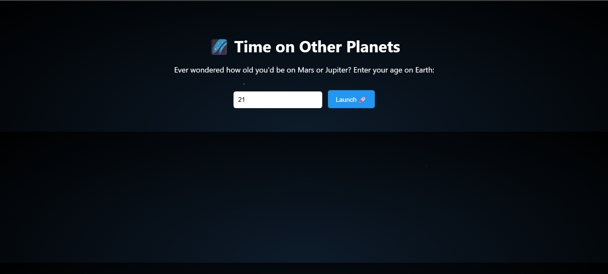
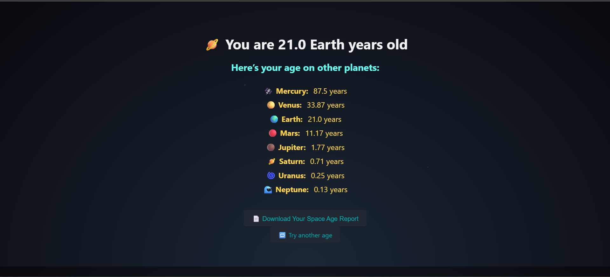
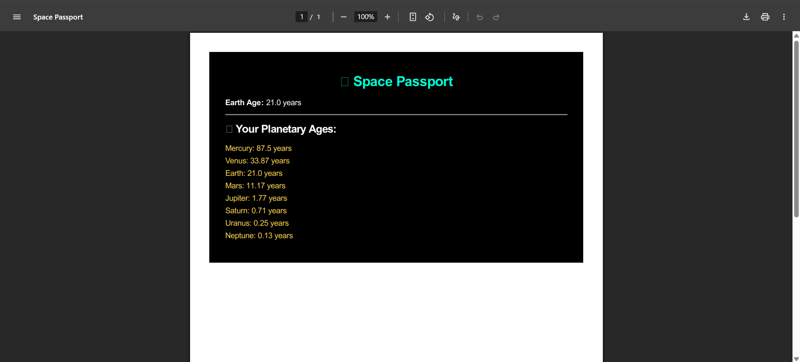

# 🌌 Age on Other Planets

A fun and interactive Flask web app that calculates your age on other planets in the solar system. It even generates a downloadable PDF "Space Passport" showing your age across the planets!

---

## 🚀 Features

- Enter your Earth age and see your age on other planets
- Beautiful, space-themed UI using HTML & CSS
- Generates a downloadable PDF report ("Space Passport")
- Error handling for invalid inputs
- Styled with animated stars and responsive design

---

## 🌍 Live Demo

> Coming soon… (you can deploy this on [Render](https://render.com), [Railway](https://railway.app), or [Heroku](https://www.heroku.com))

---

## 📸 Screenshots

| Input Page | Result Page | PDF Sample |
|------------|-------------|------------|
|  |  |  |

> (Optional — add your own screenshots under an `/assets/screenshots/` folder)

---

## 🛠️ Technologies Used

- **Python** (Flask)
- **HTML5 & CSS3** (Jinja2 templating)
- **PDFKit** (for generating PDF reports)
- **WeasyPrint** (in requirements for styling PDFs)
- **wkhtmltopdf** (PDF rendering engine)

---

## 📦 Requirements

Install dependencies with:

```bash
pip install -r requirements.txt
```

To enable PDF generation, install [wkhtmltopdf](https://wkhtmltopdf.org/downloads.html) and update the path in `app.py`:

```python
config = pdfkit.configuration(wkhtmltopdf=r'C:\Program Files\wkhtmltopdf\bin\wkhtmltopdf.exe')
```

For Linux/macOS, it might look like:

```python
config = pdfkit.configuration(wkhtmltopdf='/usr/local/bin/wkhtmltopdf')
```

---

## ▶️ Running the App

```bash
python app.py
```

Then open [http://localhost:5000](http://localhost:5000) in your browser.

---

## 📁 Project Structure

```
age-on-other-planets/
│
├── app.py
├── requirements.txt
├── .gitignore
├── templates/
│   ├── index.html
│   ├── result.html
│   └── passport_template.html
```

---

## 📄 License

This project is licensed under the MIT License.  
Feel free to fork, modify, and use it as you wish!

---

## 🙌 Acknowledgements

- Inspired by space age curiosity and planetary science.
- Background star image: [Klerith/starry-night](https://github.com/Klerith/starry-night)

---

## ✨ Author

Made with 💫 by [Nitya Dhagat](https://github.com/Nitya-Dhagat)
